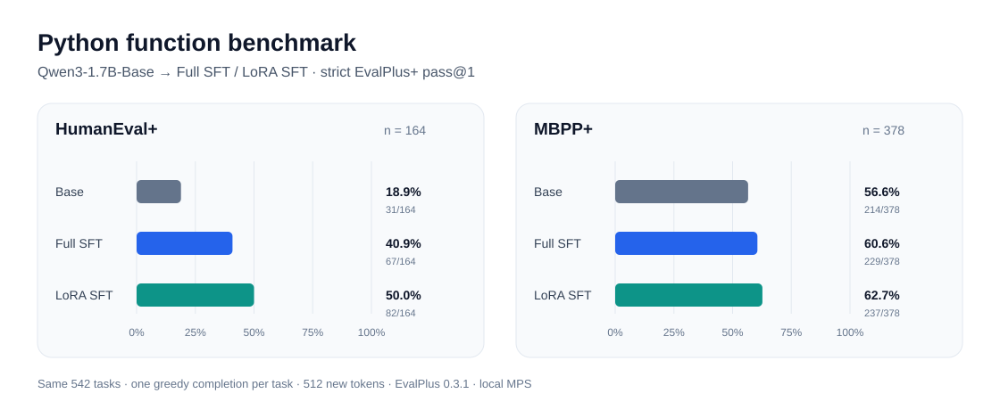

# Base、Full SFT 与 LoRA SFT 阶段报告

本报告记录截至 2026-09-24 已完成的三个阶段。训练权重保存在本地或服务器，没有纳入 GitHub 仓库；仓库保存逐题生成、Docker 判分、配置和摘要，便于之后与 DPO、PPO、GRPO 使用同一口径比较。

## 训练记录

两次 SFT 都从锁定的 `Qwen/Qwen3-1.7B-Base` 出发，在单张 RTX 4090 上使用同一份 SFT 训练集（26,805 条）和验证集（1,386 条）。两者都训练一轮，共 1,676 个优化步；每卡 batch size 为 1、梯度累积为 16，最大序列长度为 1,024，使用 bf16，且只在 completion 上计算损失。模型选择依据是 SFT 验证集 loss，没有用公开评测题选模型。

| 阶段 | 更新范围 | 学习率 | 最佳验证 loss | 训练耗时 |
| --- | --- | ---: | ---: | ---: |
| Full SFT `full-v1` | 全部参数 | 2e-5 | 0.14692 | 5,532 秒 |
| LoRA SFT `lora-v1` | 线性层 LoRA；r=16、alpha=32、dropout=0.05 | 1e-4 | 0.14723 | 8,828 秒 |

上述数值来自各阶段的 `training_meta.json`，其可公开字段和最终权重 SHA-256 已分别保存为 [Full SFT 训练摘要](../results/full_sft/full-v1/training_summary.json)与 [LoRA SFT 训练摘要](../results/lora_sft/lora-v1/training_summary.json)。耗时是训练脚本报告的 wall time，不能单凭它推断 GPU 计算效率。训练 loss 也不能代替代码测试通过率。仓库的 `scripts/train_sft.py` 和冻结的数据锁文件记录训练配置与数据版本。

## 相同口径的代码评测

三组结果使用同一个 [`eval.jsonl`](../eval.jsonl)，其 SHA-256 为 `a16f69e2168931ada41de942eac5bea64b7398a11f2d93d5c183351d39cd529f`。测试分别是 HumanEval+ v0.1.10 的 164 题和 MBPP+ v0.2.0 的 378 题。所有模型在本地 MPS 上使用原始代码题干、贪心解码、每题一份答案、最多 512 个新 token；用相同的 EvalPlus 0.3.1 Docker 镜像执行原始代码，不做自动清洗。严格 pass@1 要求原始测试和 Plus 测试都通过。

| 阶段 | HumanEval+ | 相对 Base | MBPP+ | 相对 Base |
| --- | ---: | ---: | ---: | ---: |
| [Base](../results/base/20260922T010155Z/summary.json) | 31/164（18.9%） | — | 214/378（56.6%） | — |
| [Full SFT](../results/full_sft/full-v1/summary.json) | 67/164（40.9%） | +22.0 个百分点 | 229/378（60.6%） | +4.0 个百分点 |
| [LoRA SFT](../results/lora_sft/lora-v1/summary.json) | 82/164（50.0%） | +31.1 个百分点 | 237/378（62.7%） | +6.1 个百分点 |

逐题比较可以看出净增分背后的变化：

| 比较 | HumanEval+ 由错变对 / 由对变错 | MBPP+ 由错变对 / 由对变错 |
| --- | ---: | ---: |
| Base → Full SFT | 48 / 12 | 42 / 27 |
| Full SFT → LoRA SFT | 20 / 5 | 15 / 7 |

各阶段的完整记录分别位于 [`results/base/20260922T010155Z/`](../results/base/20260922T010155Z/)、[`results/full_sft/full-v1/`](../results/full_sft/full-v1/) 和 [`results/lora_sft/lora-v1/`](../results/lora_sft/lora-v1/)。每个目录独立保留 `config.json`、`*.samples.jsonl`、`*.samples_eval_results.json`、Docker 日志和 `summary.json`。摘要中的逐题结果 SHA-256 可用于验证判分文件未被替换。

## 解读边界

- LoRA SFT 在当前两套公开题上高于 Full SFT，但两种训练的学习率和优化器也不同，因此不能把差异单独归因于参数更新方式。
- 数据准备做过题干去重和连续词重合检查，但不能排除语义近似题或公开数据污染；这些分数不是未见代码任务的保证。
- 标准答案自检也有 HumanEval/32 和 Mbpp/255 未通过；所有阶段仍统一纳入完整题数，保证比较口径一致。
- DPO、奖励模型、PPO、GRPO 尚无正式结果；完成后可用仓库的 `scripts/compare_eval.py` 生成六阶段最终对比。
